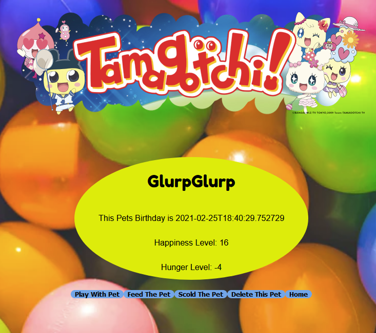
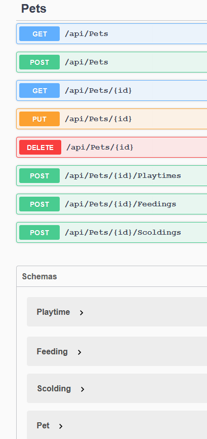

# [Tamagotchi Front End](https://tamagotchi-front-end-eight.netlify.app/)

This was a great project I had fun with because it allowed me to use an API I had built in C# and then build a front-end for it using REACTs useState,useEffect, and REACT ROUTER.

The Object of this project:

Design a front end application that has multiple features and pages:

    Have fun with the styling. Make your CSS neat and presentable, but apply your creativity!
    The home page should show a list of all the pets in your API. The listing should include their name, birthday, hunger level, and happiness level.
    Add a form to your home page to input a new pet's name and use your "CREATE" API to make a new pet. The list of pets should refresh.
    Make each pet on the home page a <Link> to a page showing the pet's detail. The detail page should show the name, birthday, hunger level, and happiness level.
    On the detail page, add buttons to:
        Play with the pet
        Feed the pet
        Scold the pet
    After each of the above actions, reload the data for the pet (use React to do this, NOT a force page reload)
    Add a button to delete a pet. After deletion, redirect the user to the home page
    Add a link on the detail page to navigate to the home page.

DEPLOY your front end and test it on your netlify version.
